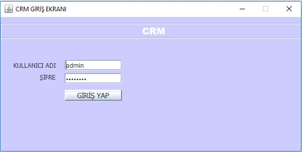
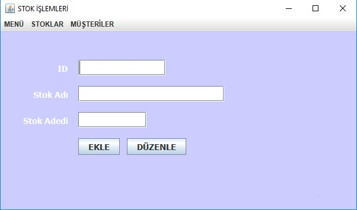

# NYP-CRM




## Veritabanı konfigürasyonu aşağıdaki gibi olmalıdır.

```
Veritabanı Sunucusu: localhost
Veritabanı Adı: crm
Kullanıcı: root
Şifre:
(Şifre kullanılmamıştır.)

```

## Kullanıcı adı ve şifre:

```
admin
password
```
